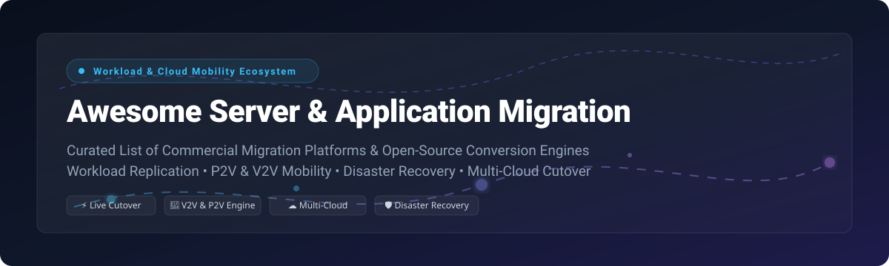

<p align="center">
  
</p>

<p align="center">
  <a href="https://github.com/ishandutta2007/Awesome-Awesome-Awesome"></a><a href="https://discord.gg/jc4xtF58Ve"></a>
  <a href="https://github.com/ishandutta2007/Awesome-Server-Application-Migration/stargazers"></a>
  <a href="https://github.com/ishandutta2007/Awesome-Server-Application-Migration/network/members"></a>
  <a href="https://github.com/ishandutta2007/Awesome-Server-Application-Migration/blob/main/LICENSE"></a>
  <a href="https://github.com/ishandutta2007/Awesome-Server-Application-Migration/pulls"></a>
  <a href="https://github.com/ishandutta2007"></a>
</p>

# 🚀 Awesome Server & Application Migration Ecosystem

> **Curated Directory of Enterprise SaaS Migration Platforms & Open-Source Workload Mobility Tools**  
> *Comprehensive guide covering Physical-to-Virtual (P2V), Virtual-to-Virtual (V2V), Cloud-to-Cloud, Container Migration, Live Disaster Recovery, and Automated Cutover Orchestration.*

---

## 📌 Executive Overview & SEO Guide

Modern server and application migration requires robust tools for seamless **lift-and-shift**, **block-level continuous replication**, and **hypervisor guest driver injection**. Whether transitioning off legacy VMware vSphere, migrating physical workloads to AWS/Azure/GCP, or adopting cloud-native Kubernetes infrastructure, choosing the right toolchain is critical to minimize downtime and risk.

This repository tracks **enterprise commercial SaaS platforms** and **open-source Github projects** organized by capabilities, pricing, company market presence, and community popularity.

---

## 📚 Table of Contents

- [🏢 SaaS & Hosted Migration Platforms](#-saas--hosted-migration-platforms)
- [🔓 Open-Source GitHub Migration Tools](#-open-source-github-migration-tools)
  - [Core Infrastructure & Automation](#core-infrastructure--automation)
  - [Cloud-Native & Container Mobility](#cloud-native--container-mobility)
  - [Hypervisors & HCI Platforms](#hypervisors--hci-platforms)
  - [Dedicated V2V & Disk Conversion Engine Tools](#dedicated-v2v--disk-conversion-engine-tools)
- [🛠️ Key Migration Architecture Patterns](#%EF%B8%8F-key-migration-architecture-patterns)
- [🤝 How to Contribute](#-how-to-contribute)
- [⚠️ Enterprise Disclaimer](#%EF%B8%8F-enterprise-disclaimer)
- [⭐ Star History](#-star-history)
- [💖 Support & Contributing](#-support--contributing)

---

## 🏢 SaaS & Hosted Migration Platforms

> **Market Intelligence**: The global server and application migration market is estimated at **\$15.8 Billion** with a ~21.5% CAGR. The sector is **moderately fragmented**, anchored by hyperscale public cloud providers (Microsoft Azure, AWS, Google Cloud) offering first-party migration services alongside specialized enterprise disaster recovery and continuous replication vendors.

The table below lists leading commercial SaaS and hosted migration solutions, **sorted by parent company size / revenue (descending)**:

| Product / Vendor | Description & Core Migration Capabilities | Specific Starting Tier Pricing | Free Tier / Free Trial Limits | Company Size / Revenue / Valuation |
| :--- | :--- | :--- | :--- | :--- |
| **[Azure Site Recovery](https://azure.microsoft.com/en-us/products/site-recovery/)** | **Microsoft's enterprise DR & VM migration service**. Continuous block replication of physical servers, VMware, Hyper-V, and AWS VMs into Azure. | **\$25.00 / instance / month** (to Azure destination); \$54.00/instance/month to customer site. | **First 31 days free** for every protected instance migrated to Azure. | **\$245B+ Annual Revenue** / \$3.1T Market Cap (Microsoft) |
| **[AWS Application Migration Service](https://aws.amazon.com/application-migration-service/)** | **AWS primary lift-and-shift engine (AWS MGN)**. Non-disruptive, block-level continuous replication for physical, virtual, or cloud servers to AWS EC2. | **\$0.04 / hour / server** (~$28.80/mo) after free tier period. | **First 90 days free** for each server migrated to AWS. | **\$105B+ Annual Revenue** / \$2.1T Market Cap (Amazon AWS) |
| **[Google Cloud Migrate to Virtual Machines](https://cloud.google.com/migrate/virtual-machines)** | **Google's agentless VM migration engine**. Direct streaming migration of VMware, AWS, Azure workloads into Compute Engine with background sync. | **\$0.00 base tool license** (Standard GCP storage/compute usage fees apply, ~$0.02–$0.08/GB). | **Free migration engine usage** + \$300 free credits over 90 days for new GCP accounts. | **\$33B+ Cloud Annual Revenue** / \$2.0T Market Cap (Alphabet) |
| **[HPE Zerto](https://www.zerto.com/)** | **Enterprise CDP & migration platform**. Near-zero RPO/RTO continuous data protection and cross-hypervisor migration (VMware, Hyper-V, AWS, Azure). | **\$85.00 / VM / year** (Zerto Enterprise Cloud starting license tier). | **14-day full-feature trial** with protection for up to 10 VMs. | **\$29B Annual Revenue** / \$25B Market Cap (Hewlett Packard Enterprise) |
| **[Carbonite Migrate / PlateSpin](https://www.carbonite.com/migrate/)** | **Real-time host replication & automated cutover**. Moves physical, virtual, and cloud workloads between any source and target with minimal downtime. | **\$495.00 per server migration license** (one-time migration license per host). | **30-day full functional evaluation trial** per target host. | **\$5.8B Annual Revenue** / \$7.5B Enterprise Valuation (OpenText) |
| **[Veeam Backup & Replication](https://www.veeam.com/)** | **Backup, recovery & migration ecosystem**. Instant VM Recovery, cross-platform restore to AWS/Azure/GCP, and VMware-to-Hyper-V migration. | **\$180.00 / year** for Veeam Universal License (VUL) 10-pack (~$18/workload/yr). | **Veeam Community Edition free forever** (up to 10 workloads) + 30-day trial. | **\$1.5B Annual Recurring Revenue (ARR)** / \$5.0B Valuation |
| **[Commvault Cloud Migration](https://www.commvault.com/)** | **Multi-cloud data management & mobility**. Automated workload discovery, porting, and disaster recovery across hybrid cloud environments. | **\$15.00 / VM / month** (Commvault Cloud Data Protection & Mobility tier). | **30-day free trial** supporting up to 100 VMs. | **\$830M Annual Revenue** / \$4.2B Market Cap (Commvault Systems) |
| **[Cohesity DataCloud Migration](https://www.cohesity.com/)** | **Data security & multi-cloud migration**. Agentless backup, instant recovery, and cloud spin-up for VMware and physical enterprise servers. | **\$90.00 / TB / year** (Cohesity Data Cloud management & migration tier). | **30-day free trial** on Cohesity DataCloud tenant. | **\$500M+ Annual Recurring Revenue (ARR)** / \$1.6B Valuation |

---

## 🔓 Open-Source GitHub Migration Tools

Open-source migration engines empower organizations to achieve **cloud sovereignty**, avoid vendor lock-in, and customize V2V/P2V conversions. Below is a curated list of top open-source projects, **sorted by GitHub star count (descending)**:

### Core Infrastructure & Automation

- **[Ansible](https://github.com/ansible/ansible)** [](https://github.com/ansible/ansible/stargazers)  
  *Radically simple IT automation engine.* Essential for post-migration server configuration, guest driver injection, network reconfiguration, and automated validation playbooks across target host environments.

- **[Terraform](https://github.com/hashicorp/terraform)** [](https://github.com/hashicorp/terraform/stargazers)  
  *Declarative Infrastructure as Code (IaC).* Standard tool for provisioning target cloud infrastructure (VPCs, subnets, instances, storage volumes) prior to workload migration cutovers.

### Cloud-Native & Container Mobility

- **[Velero](https://github.com/velero-io/velero)** [](https://github.com/velero-io/velero/stargazers)  
  *Kubernetes backup, disaster recovery, and cluster migration tool.* Safely backs up and restores K8s cluster resources and persistent volume data across Kubernetes clusters and cloud providers.

- **[OpenEBS](https://github.com/openebs/openebs)** [](https://github.com/openebs/openebs/stargazers)  
  *Leading Container Attached Storage (CAS) for Kubernetes.* Enables persistent volume replication and storage workload mobility across on-premises and multi-cloud Kubernetes deployments.

- **[Longhorn](https://github.com/longhorn/longhorn)** [](https://github.com/longhorn/longhorn/stargazers)  
  *Cloud-native distributed block storage built for Kubernetes.* Provides cross-cluster volume snapshotting, backup, and volume migration capabilities with minimal downtime.

- **[KubeVirt](https://github.com/kubevirt/kubevirt)** [](https://github.com/kubevirt/kubevirt/stargazers)  
  *Virtual machine management addon for Kubernetes.* Allows running traditional VM workloads side-by-side with containers inside Kubernetes, supporting live VM migration across worker nodes.

### Hypervisors & HCI Platforms

- **[Harvester](https://github.com/harvester/harvester)** [](https://github.com/harvester/harvester/stargazers)  
  *Open-source hyperconverged infrastructure (HCI) built on Kubernetes and KubeVirt.* Provides enterprise VM live migration, snapshotting, and image import tools for migrating off legacy VMware setups.

- **[OpenStack Nova](https://github.com/openstack/nova)** [](https://github.com/openstack/nova/stargazers)  
  *Cloud compute fabric controller.* Features high-performance parallel memory live migration, vTPM state transfer, and cold instance migration across multi-node OpenStack clouds.

- **[Apache CloudStack](https://github.com/apache/cloudstack)** [](https://github.com/apache/cloudstack/stargazers)  
  *Turnkey open-source Cloud Management Platform.* Supports live VM migration, volume attach/detach mobility, and cross-storage pool migrations across KVM, XenServer, and VMware.

- **[oVirt Engine](https://github.com/oVirt/ovirt-engine)** [](https://github.com/oVirt/ovirt-engine/stargazers)  
  *Open-source virtualization management system.* Manages KVM clusters with automated VM workload live migration, high availability, and storage domain migration.

- **[Proxmox VE Manager](https://github.com/proxmox/pve-manager)** [](https://github.com/proxmox/pve-manager/stargazers)  
  *Complete open-source enterprise virtualization platform.* Includes built-in zero-downtime live migration for QEMU virtual machines and LXC containers.

### Dedicated V2V & Disk Conversion Engine Tools

- **[libguestfs](https://github.com/libguestfs/libguestfs)** [](https://github.com/libguestfs/libguestfs/stargazers)  
  *The core C library and toolset for accessing and modifying VM disk images.* Provides low-level disk inspection, partition resizing, and guest file modification used by virt-v2v.

- **[virt-v2v](https://github.com/libguestfs/virt-v2v)** [](https://github.com/libguestfs/virt-v2v/stargazers)  
  *The foundational open-source V2V conversion tool.* Converts guest VMs from VMware vSphere, Xen, and Hyper-V to run on KVM, automatically injecting VirtIO drivers and fixing bootloaders.

- **[Coriolis](https://github.com/cloudbase/coriolis)** [](https://github.com/cloudbase/coriolis/stargazers)  
  *Cloud Migration as a Service platform by Cloudbase Solutions.* Automates migration of VMs, disks, and networking between VMware, AWS, Azure, OpenStack, and GCP with automatic cloud-init injection.

- **[Migration Manager (FuturFusion)](https://github.com/FuturFusion/migration-manager)** [](https://github.com/FuturFusion/migration-manager/stargazers)  
  *Modern instance migration utility for VMware vSphere → Incus.* Features REST API, CLI, and Web UI to discover vCenter VMs, configure batch cutovers, and migrate to Incus containers/VMs.

- **[OpenNebula OneSwap](https://github.com/OpenNebula/one-swap)** [](https://github.com/OpenNebula/one-swap/stargazers)  
  *In-place datastore VMware workload migration tool for OpenNebula.* Converts VMware VMDKs directly on datastores to KVM without requiring local disk copies.

- **[h2kvm](https://github.com/zyvorai/h2kvm)** [](https://github.com/zyvorai/h2kvm/stargazers)  
  *Any Hypervisor to KVM migration toolchain.* Operates without VMware VDDK dependencies via vSphere API/NFS and applies offline fixes to VirtIO, GRUB, and Windows bootloaders.

- **[hyper2kvm](https://github.com/ssahani/hyper2kvm)** [](https://github.com/ssahani/hyper2kvm/stargazers)  
  *Enterprise-grade VM migration toolkit with Kubernetes Operator.* Designed for large-scale enterprise migrations with Prometheus metrics, Helm charts, and automated guest validation.

- **[GuestKit](https://github.com/ssahani/guestkit)** [](https://github.com/ssahani/guestkit/stargazers)  
  *Pure-Rust VM disk inspection tool.* Provides automated pre-migration diagnostics to detect missing drivers, OS partition errors, and bootloader incompatibilities before cutover.

---

## 🛠️ Key Migration Architecture Patterns

When executing server and application migrations, enterprise teams utilize three primary architectural patterns:

```
[ Physical / Source VM ] ───► (1. Block Continuous Replication) ───► [ Cloud / Target Staging ]
                         ───► (2. Guest Driver Injection - VirtIO) ───► [ Final Cutover & Boot ]
```

1. **Continuous Block-Level Replication (Live Migration)**:  
   *SaaS options*: AWS MGN, Azure Site Recovery, Zerto.  
   *Open-source options*: Velero, Longhorn, QEMU/KVM Live Migration.  
   *Best for*: Mission-critical enterprise production applications where RPO/RTO must be kept in seconds/minutes.

2. **Offline V2V Disk Conversion & Driver Fixup**:  
   *Tools*: `virt-v2v`, `h2kvm`, `GuestKit`, `OpenNebula OneSwap`.  
   *Best for*: VMware vSphere to KVM / Proxmox / Harvester migrations where VDDK licenses are unavailable and guest OS bootloader reconfiguration is required.

3. **Cloud-Native Containerization & IaC Provisioning**:  
   *Tools*: Terraform, Ansible, KubeVirt, Migration Manager.  
   *Best for*: Replatforming VMs directly onto Kubernetes or modern cloud infrastructure.

---

## 🤝 How to Contribute

We welcome community contributions! To add or update a migration product or open-source tool:

1. Fork this repository.
2. Update `README.md` following the exact table or bullet format.
3. For SaaS products: Ensure specific pricing, free tier details, and company revenue/valuation are included.
4. For Open-Source repos: Ensure the GitHub star social badge is attached with the stargazer link.
5. Open a Pull Request with a clear summary of your changes.

Check out our curated meta-list at [Awesome-Awesome-Awesome](https://github.com/ishandutta2007/Awesome-Awesome-Awesome).

---

## ⚠️ Enterprise Disclaimer

- This list is **community-curated** for research and educational purposes.
- Server and application migrations carry inherent operational risks. Always perform test migrations in isolated sandbox environments prior to production cutovers.
- Pay attention to driver signing (especially on Windows Server 2022/2025) and bootloader configurations (UEFI vs BIOS) during hypervisor conversions.

---

## ⭐ Star History

[](https://star-history.dera.page/#ishandutta2007/Awesome-Server-Application-Migration&type=date&legend=top-left)

---

## 💖 Support & Contributing

Thank you for exploring **Awesome Server & Application Migration**! If this repository helped your team plan cloud migrations or infrastructure modernizations, please consider supporting us:

- ⭐ **Star this repository** to help others discover it!
- 🔀 **Fork and share** with your cloud engineering and DevOps network.
- ☕ **Sponsor & Buy a Coffee**: Support our ongoing open-source maintenance via [GitHub Sponsors](https://github.com/sponsors/ishandutta2007).

<p align="center">
  <a href="https://github.com/sponsors/ishandutta2007">
    
  </a>
</p>

---

*Made with ❤️ for Cloud Architects, DevOps Engineers, and Infrastructure Specialists worldwide.*
